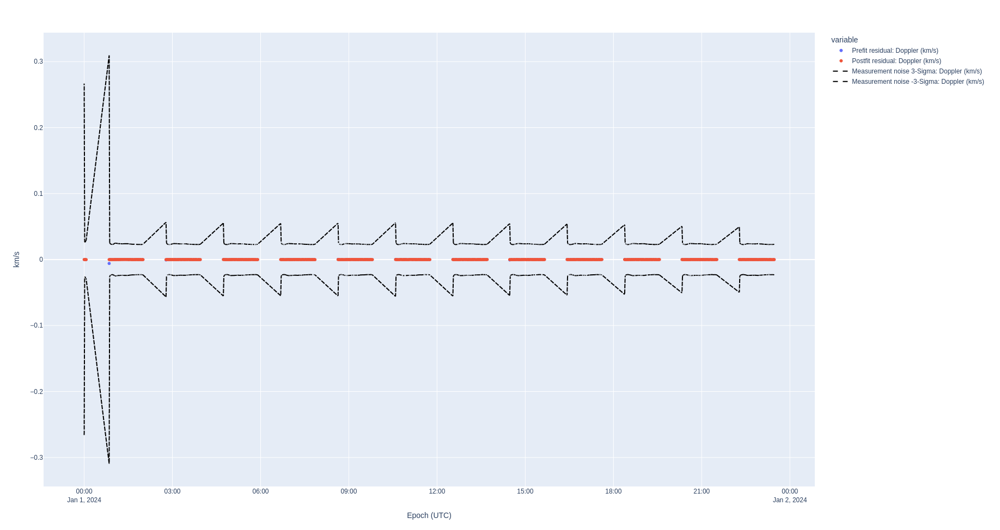

# Nyx: Comprehensive Spaceflight Dynamics

[**Empowering flight dynamics engineers with open-source software**][website]

Nyx is revolutionizing the field of flight dynamics engineering as a powerful, open-source tool for mission design and orbit determination. From trajectory optimization to orbit estimation, Nyx is built for speed, automation, and scalability.

**Nyx has proven mission-critical reliability, already contributing to the success of several lunar missions including Firefly Blue Ghost 1 and NASA/Adanced Space CAPSTONE.**

[![Nyx Space Badget][nyxspace-image]][website]
[![Contact Form][contact-form-image]][contact]

[![nyx-space on crates.io][cratesio-image]][cratesio]
[![nyx-space on docs.rs][docsrs-image]][docsrs]

# License

The core of Nyx is provided under the [AGPLv3 License](./LICENSE). The foundational components of Nyx are open-source and accessible to everyone.

By using this software, you assume responsibility for adhering to the license. Refer to [the pricing page](https://nyxspace.com/pricing/?utm_source=readme-price) for an FAQ on the AGPLv3 license. Notably, any software that incorporates, links to, or depends on Nyx must also be released under the AGPLv3 license, even if you distribute an unmodified version of Nyx.

Starting with version `2.2.0-alpha`, Nyx now offers a set of advanced functionalities available under a `premium` crate feature. This feature operates under a **dual-license** model.

## The `premium` Feature License

The `premium` feature is available for use free of charge under the standard AGPLv3 license for the following users:
* Individuals
* Non-profit organizations
* Academic institutions
* Commercial entities with annual gross revenue of **$1,000,000 USD** (one million) or less.

Use of any code enabled by the `premium` feature is **prohibited** for any for-profit entity (including, but not limited to, companies, corporations, and organizations) whose annual gross revenue exceeds **$1,000,000 USD**.
Entities exceeding this revenue threshold **must purchase a commercial license** to enable and use the `premium` feature. This license grants you the right to use these advanced features in your commercial products and services.
To inquire about a commercial license, please contact me at **christopher.rabotin@gmail.com** or via the [contact form][contact].

_Note:_ under the assumption that most users are below this threshold, the `premium` feature is enabled _by default_. As a user **you are responsible** for ensuring compliance with the license by your entity and customers. It is enforced.

# Showcase

[The website has the latest use cases][showcase]

## GEO Low Thrust Orbit Raising & StationKeeping

[Click for description](https://nyxspace.com/nyxspace/showcase/03_geo_analysis/?utm_source=readme-showcase)

## James Webb Space Telescope Monte Carlo Simulation

[Click for description](https://nyxspace.com/nyxspace/showcase/02_jwst_covar_monte_carlo/?utm_source=readme-showcase)

## Orbit Determination of the Lunar Reconnaissance Orbiter

[Click for description](https://nyxspace.com/nyxspace/showcase/04_lro_od/?utm_source=readme-showcase)

# Documentation

The documentation is currently being updated. If you have specific use cases you would like to see documented, please [open a Github issue](https://github.com/nyx-space/nyx/issues/new?assignees=&labels=Documentation&projects=&template=documentation.md&title=) or [use the contact form][contact]

## Quick start

### Rust

To install Nyx, follow these steps:
1. Clone the repository: `git clone https://github.com/nyx-space/nyx.git`
2. Navigate to the directory: `cd nyx`
3. Run any of the [examples](./examples/), e.g. `RUST_LOG=info cargo run --example 01_orbit_prop --release`

#### Compilation

Nyx uses `lld`, the LLVM linker, for faster compilation times. You may need to manually install `lld` depending on your distribution. On Ubuntu, this command is `sudo apt install clang lld`.

### Python

For Python projects, get started by installing the library via `pip`: `pip install nyx_space`.

**Important:** The Python package has been temporarily disabled. Refer to <https://github.com/nyx-space/nyx/issues/311> for details.

# Versioning

Nyx mostly adheres to SemVer. New patch versions should be rare. Updated dependencies trigger a new minor version. _However_ new fields in structures and new behavior may also be added with minor releases, but the public facing initializers and functions should not significantly change (but may still change).

Major releases are for dramatic changes.

[cratesio-image]: https://img.shields.io/crates/v/nyx-space.svg
[cratesio]: https://crates.io/crates/nyx-space
[docsrs-image]: https://docs.rs/nyx-space/badge.svg
[docsrs]: https://rustdoc.nyxspace.com/?utm_source=readme
[contact-form-image]: https://img.shields.io/badge/Nyx_Space-Contact-orange
[contact]: https://7ug5imdtt8v.typeform.com/to/neFvVW3p
[nyxspace-image]: https://img.shields.io/badge/Nyx_Space-Website-orange
[website]: https://nyxspace.com/?utm_source=readme
[showcase]: https://nyxspace.com/nyxspace/showcase/?utm_source=readme

# Author information

> Chris Rabotin is a GNC and flight dynamics engineer with a heavy background in software.

I currently work for Rocket Lab USA as the lead flight dynamics engineer on the Blue Ghost lunar lander missions. -- Find me on [LinkedIn](https://www.linkedin.com/in/chrisrabotin/).

# External contributions

Contributions are licensed under AGPLv3 and may also be relicensed under a commercial license by Nyx Space. Contributors retain ownership of their copyrights but grant Nyx Space broad rights as outlined in the [Contributor License Agreement (CLA)](./CONTRIBUTOR_AGREEMENT.md).
