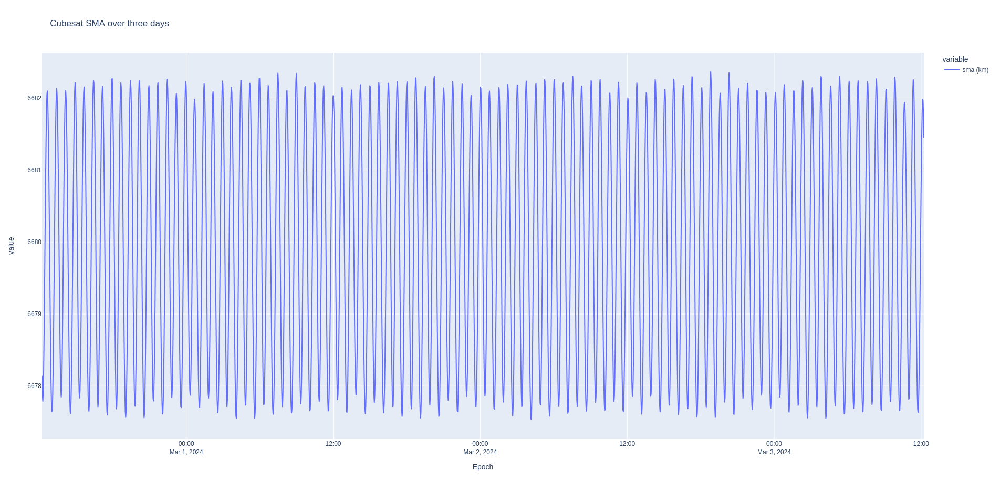
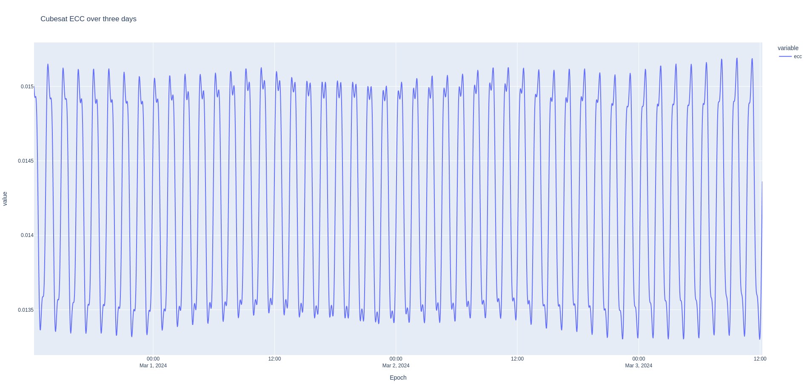

# Orbit propagation

Propagating an orbit is the core of any astrodynamics analysis. In this example, you'll learn how to propagate an orbit state using basic two body dynamics or using a high fidelity propagator with the point masses of the Moon and Sun, solar radiation pressure, and a 21x21 gravity field.

Then, you'll learn how to build some data products as dataframes using polars, and how to export the propagated trajectory as a CCSDS OEM file.

To run this example, just execute:
```sh
RUST_LOG=info cargo run --example 01_orbit_prop --release
```

Building in `release` mode will make the computation significantly faster. Specifying `RUST_LOG=info` will allow you to see all of the information messages happening in ANISE and Nyx throughout the execution of the program.

## Data products

1. Export the trajectory as a CCSDS OEM version 2.0 file and as a parquet file, which includes the Keplerian orbital elements. This can be quickly analyzed and plotted in Python.
2. Compare the difference in the radial, in-track, cross-track frame between the high fidelity and two-body/Keplerian propagation. The RIC frame is commonly used to compute the difference in position and velocity of different spacecraft. Build a Dataframe from this data and print
3. Build a Dataframe containing the azimuth, elevation, range, and range-rate data of that spacecraft as seen from Boulder, CO, USA. Print out when the spacecraft has an elevation of 15 degrees or above on the horizon.

## Force models

The force models used here are akin to STK's "HPOP" propagator. Specifically, this example runs with the following models:
- Point masses of the Earth, Moon, and Sun, where the gravitational parameters are sourced from NASA's [pck00011.tpc](https://naif.jpl.nasa.gov/pub/naif/generic_kernels/pck/pck00011.tpc) file (note that these differ slightly from GMAT's values). The planetary ephemeris used is the DE440s.bsp, provided by NASA as well.
- Solar radiation pressure, with only the Earth as an eclipsing body
- Spherical Harmonics of the Earth of order and degree 21x21, computed in the IAU Earth frame. The data comes from the JGM3 gravitational model, downloaded automatically using ANISE's `MetaFile` downloading and local caching mechanism. This is the default gravity field model of GMAT.

## Quick analysis

In two body propagation, all orbital elements remain constant apart from the true anomaly. In real life, the oblateness of the Earth causes the right ascension of the ascending node to drift with time (red line below). The other force models also affect the overall orbit.






_Note_: These plots were generated with an SRP area of that was ten times larger than the correct value, hence you may notice slightly different Keplerian orbital elements, notably for the change in the shape of the orbit.
