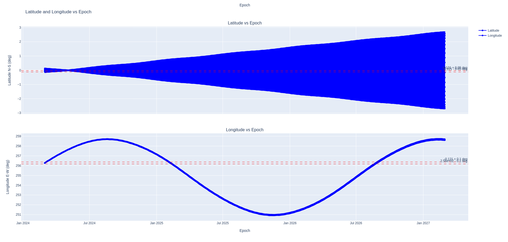
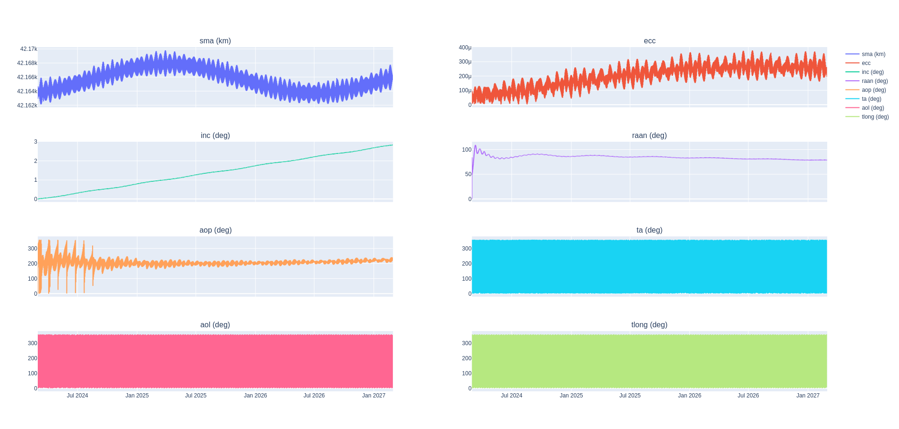
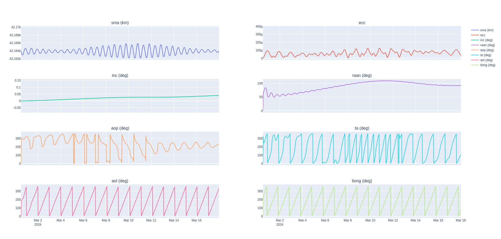
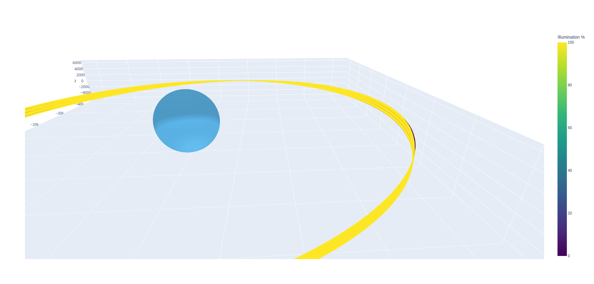
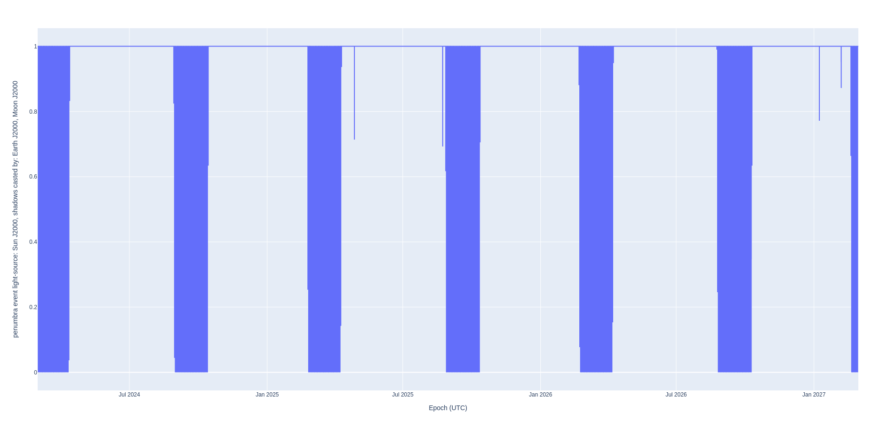
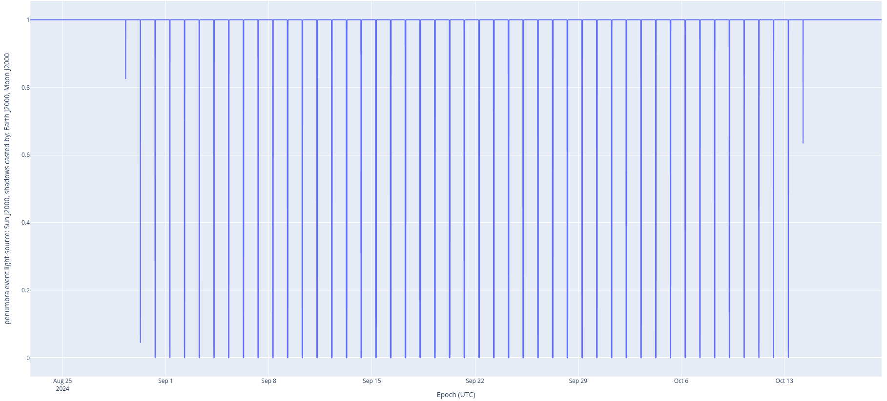
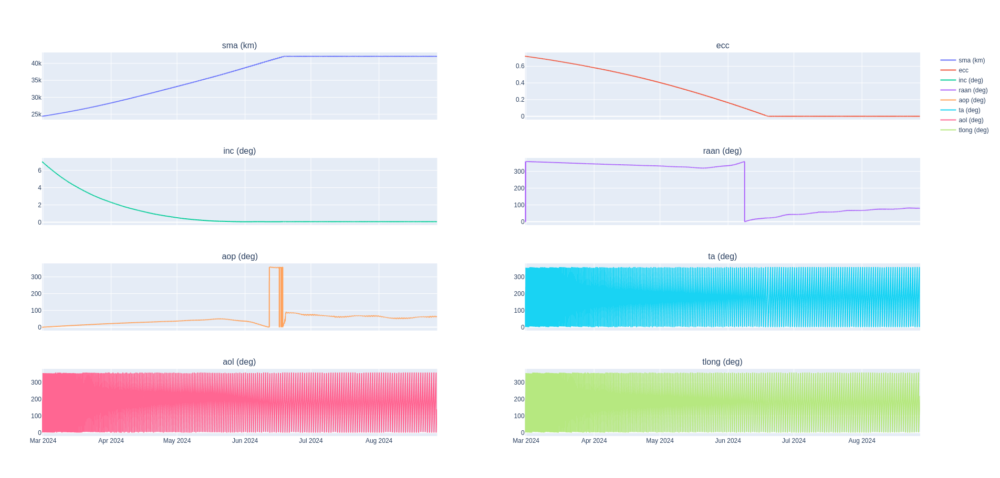
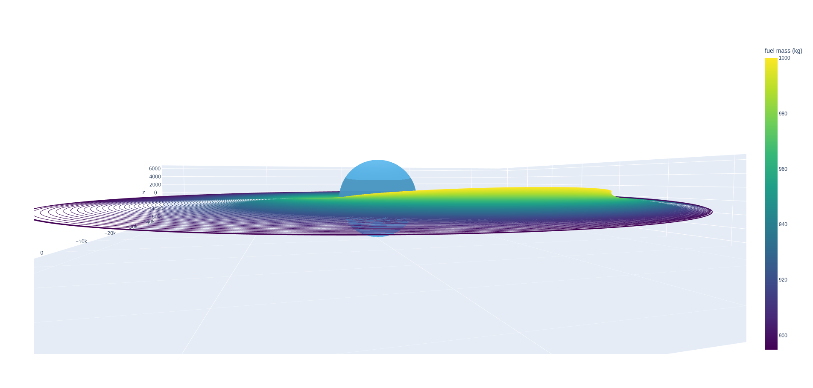
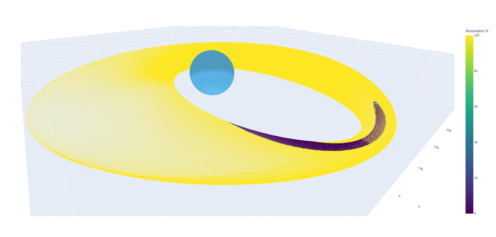

# Geostationary spacecraft analysis

GEO birds have specific station keeping requirements. In this preliminary study, we'll look at the drift rate inside the GEO box, the orbit raising from a GTO to a GEO orbit, and run a Monte Carlo of the station keeping requirements.

## Drift

### Objective

As documented in the [drift analysis code](./drift.rs), we're trying to gain insight into how quickly a vehicle would drift outside of an arbitrary box. The spacecraft is placed arbitrarily to be in a GEO orbit centered on Colorado, USA. We then propagate the original spacecraft position in high fidelity with the following dynamics:

- Earth gravity field of 21x21, JGM3 model -- we don't need a super high field here because the spacecraft is ~42 Mm above the Earth
- Solar radiation pressure, accounting for the shadow and penumbra cast by the Earth and the Moon at each time step
- Point mass gravity of the Moon and Sun (in addition to the Earth, the central body)

To run the [drift analysis](./drift.rs) example, just execute:
```sh
RUST_LOG=info cargo run --example 03_geo_drift --release
```

The vehicle is not under any active control in this example. We're really only trying to gain insight into the periodicity of the orbit.

**Performance wise**, Nyx can propagate these high fidelity dynamics at about 560 days per minute on my 8 year old computer, or about 1.5 years per minute, even for much longer propagation times.

```sh
 INFO  nyx_space::propagators::instance   > Propagating for 1095 days 18 h until 2027-03-01T06:13:14 UTC
 INFO  nyx_space::propagators::instance   > 	... current epoch 2025-09-22T07:51:27.645581934 UTC, remaing 524 days 22 h 21 min 46 s
 INFO  nyx_space::propagators::instance   > 	... done in 1 min 55 s 661 ms 536 μs 822 ns
(...)
Longitude changed by -2.352 deg -- Box is 0.1 deg E-W
Latitude changed by -2.637 deg -- Box is 0.05 deg N-S
Altitude changed by -10.407 km -- Box is 30 km
```

### Analysis and verification

#### GEO box

The ITU allocates specific geostationary boxes to a number of states, who then grant their use to specific operators on the condition that they remain in that box.

In this analysis, we're assessing how quickly an arbitrary GEO bird would drift out of the box. After running the `03_geo_drift` example, run the `plot_drift.py` and `plot_orbital_elements.py` (with the proper parquet file as an input) scripts.

The latitude and longitude drift quite rapidly out of this arbitrary box of +/- 0.1 degrees East/West and +/- 0.05 degrees North/South.





Zooming into the drift of three weeks allows us to see a bit more of the short term trends. It also becomes more obvious why circular equatorial orbits usually use the true longitude instead of the true anomaly as a phasing angle: the former varies nearly-linearly whereas the latter is ill-defined.



#### Eclipsing

As expected for GEO birds, there are only a few eclipsing periods throughout a three year span. These eclipses are quite short, but we want to capture them. To do so, we export the penumbra event (look for `trajectory.to_parquet` in the code) at a 5 minute interval, ensuring that we interpolate the propagated trajectory every five minutes and evaluate the event at that same sample rate.



We can also use polars and plotly in Python directly to plot when these eclipses happen.

```py
>>> import polars as pl
>>> import plotly.express as px
>>> df = pl.read_parquet("03_geo_hf_prop.parquet")
>>> px.line(df, x="Epoch (UTC)", y="penumbra event light-source: Sun J2000, shadows casted by: Earth J2000, Moon J2000")
```

We have daily eclipses during the equinoxes, as [verified by other sources](https://www.sws.bom.gov.au/Educational/5/4/3).

> Between 28 February and 11 April, and between 2 September and 14 October, roughly 21 days either side equinoxes, satellites in geostationary orbits will pass through the shadow of the earth once every day.





Refer to the [Eclipse section of the MathSpec](https://nyxspace.com/nyxspace/MathSpec/celestial/eclipse/) for computation details.

## Orbit raise

Most GEO spacecraft are deployed on a geostationary transfer orbit (GTO) and must rely on their own propulsion to reach their allocated GEO slot. Over the past fifteen years, we've seen a shift in the industry from high thrust birds to low thrust propulsion as they're many times more efficient. However, the optimization of the trajectory for low thrust propulsion is significantly more complicated. **Nyx allows for the development of custom guidance laws using the [`GuidanceLaw`](https://rustdoc.nyxspace.com/nyx_space/dynamics/guidance/trait.GuidanceLaw.html) trait.**

As of version 2.0.0-rc, Nyx ships with the closed loop Ruggerio guidance law. This is a locally optimal law for low thrust propulsion. It allows targeting of all orbital elements _apart_ from the phasing (e.g. the true anomaly). As such, when applied to orbit raising, it is useful for reaching the vicinity of a desired orbital slot and maintaining control of the shape and inclination of an orbit, but more complicated methods are recommended to reach to exact ITU-allocated slot. **A more optimal guidance law for this problem is the Q-Law**, whose implementation in Nyx has been on the backburner for years. The Q-law guidance law is as optimal as a global trajectory optimizer where the phasing is left free, but runs extremely fast.

To run the [orbit raise analysis](./raise.rs) example, just execute:
```sh
RUST_LOG=info cargo run --example 03_geo_raise --release
```

To build the following plots, use the `plot_3d_traj.py` script and the `plot_orbital_elements.py` scripts.



In the two follow plots, the colors correspond to the remaining fuel mass, thereby showing the fuel depletion over the orbit raise.


Looking edge-on shows how the inclination is changed over time.



During the orbit raise, a low thrust vehicle will most likely not thrust when it's in the shadow. In this analysis, we specify that the vehicle should not thrust when it is in over 80% of penumbra, i.e. it can only generate _at most_ 20% of the power it would generate in full sunshine (depending on pointing of course).

