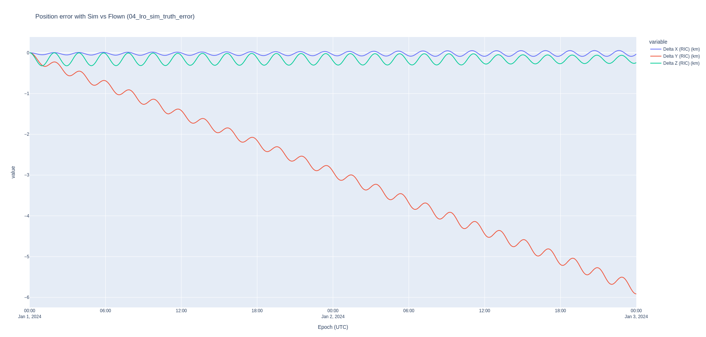
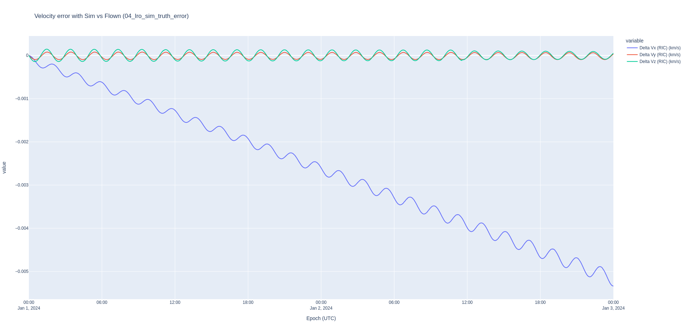
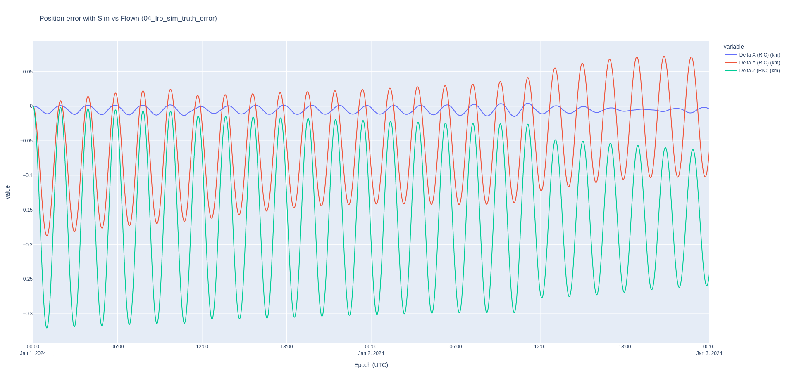
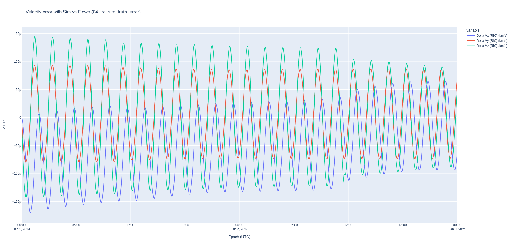

# Orbit Determination of the Lunar Reconnaissance Orbiter

**Spacecraft operations require high fidelity modeling of the orbital dynamics and high fidelity orbit determination. We will prove that the LRO team can use Nyx for its orbit determination.**

In this example, you'll learn how to use an "as-flown" (_definitive_) SPICE BSP ephemeris file to simulate orbit determination measurements from ground stations. Then, you'll learn how to set up an orbit determination process in Nyx with high fidelity Moon dynamics and estimate the state of LRO. Finally, you'll learn how to compare two ephemerides in the Radial, In-track, Cross-track (RIC) frame.

To run this example, just execute:
```sh
RUST_LOG=info cargo run --example 04_lro_od --release
```

Building in `release` mode will make the computation significantly faster. Specifying `RUST_LOG=info` will allow you to see all of the information messages happening in ANISE and Nyx throughout the execution of the program.

Throughout this analysis, we'll be focusing on an arbitrarily chosen period of two days.

# Preliminary analysis: matching dynamical models

In the case of the Lunar Reconnaissance Orbiter (herein _LRO_), NASA publishes the definitive ephemeris on the website. Therefore, the first step in this analysis is to match the dynamical models between the LRO team and Nyx. This serves as a validation of the dynamical models in Nyx as well.

The original ephemeris file by NASA is in _big endian_ format, and my machine (like most computers) is little endian. I've used the `bingo` tool from https://naif.jpl.nasa.gov/naif/utilities_PC_Linux_64bit.html to convert the original file to little endian and upload it to the public data cloud hosted on <http://public-data.nyxspace.com>. Refer to https://naif.jpl.nasa.gov/pub/naif/pds/data/lro-l-spice-6-v1.0/lrosp_1000/data/spk/?C=M;O=D for original file. Also note that throughout this analysis, we're using the JPL Development Ephemerides version 421 instead of the latest and greated DE440 because LRO uses DE421 (although analysis shows no noticeable difference in switching out these ephems).

For this preliminary analysis, we'll configure the dynamical models taking inspiration from the 2015 paper by Slojkowski et al. [Orbit Determination For The Lunar Reconnaissance Orbiter Using
An Extended Kalman Filter](https://ntrs.nasa.gov/api/citations/20150019754/downloads/20150019754.pdf). In this paper, the LRO team compares the OD solution between GTDS and AGI/Ansys ODTK. We will be performing the same analysis but with Nyx!

Cislunar propagation involves a handful of decently well determined forces, so we can use these directly in Nyx:

- Solar radiation pressure;
- Point mass gravity forces from the central object (Moon) and other celestial objects whose force is relevant, namely Earth, Sun, Jupiter, maybe Saturn;
- Moon gravity field because we're in a low lunar orbit, so it greatly affects the orbital dynamics

The purpose of this analysis is to ensure that we've configured these models correctly. This process is tedious because each dynamical model must be configured differently and the difference between the propagation and the truth ephemeris need to be assessed.

When using the GRAIL gravity model JGGRX 250x250 with the SRP configured with a coefficient of reflectivity of `0.96` (as per the LRO OD paper above), and the gravity parameter provided by JPL (and default in ANISE 0.4), we end up with a pretty large error shown in these Radial, In-Track, Cross-Track plots.





Since the velocity is the time derivative of the position, and since the error in the velocity is almost exclusively in the radial direction (i.e. from the spacecraft to the center of the Moon), the primary hypothesis is that the error is due to the gravity parameter of the Moon. In other words, the mass of the Moon used by LRO when they publish their ephemeris is different from the latest and greatest provided in [`gm_de440.tpc`](https://naif.jpl.nasa.gov/pub/naif/generic_kernels/pck/gm_de440.tpc), used by ANISE.

**In fact, after dozens of simulations using a secant method, we find that the gravity parameter that leads to the least error is 4902.74987 km^3/s^2**. This is surpringly far from the nominal value of 4902.800066163796 km^2/s^3. Other parameters that I've fiddled with include changing the GRAIL gravity field to an older version, changing the degree and order of the gravity field, changing the value of the coefficient of reflectivity, enabling the point mass gravity of the Saturn system barycenter, changing the body fixed frame of the gravity field to the Moon ME frame (which should only be used for cartography), and swapping the DE421 for the DE440 planetary ephemerides.



