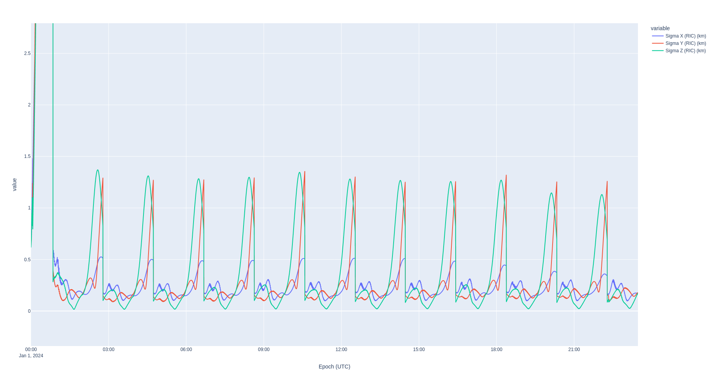
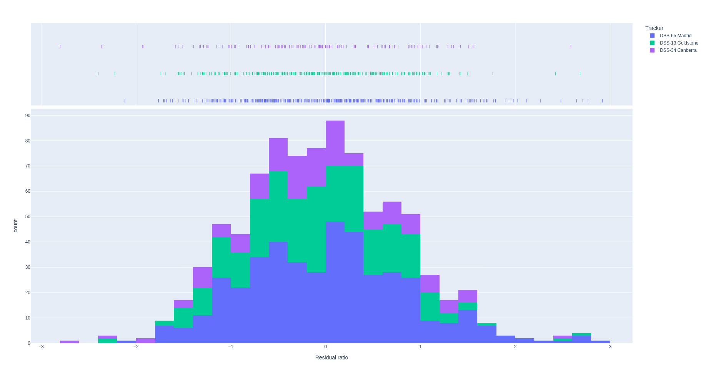
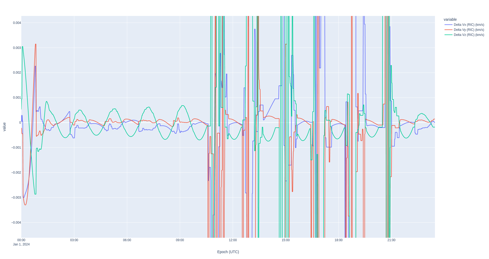

# Orbit Determination of the Lunar Reconnaissance Orbiter

**Spacecraft operations require high fidelity modeling of the orbital dynamics and high fidelity orbit determination. We will prove that the LRO team can use Nyx for its orbit determination.**

In this example, you'll learn how to use an "as-flown" (_definitive_) SPICE BSP ephemeris file to simulate orbit determination measurements from ground stations. Then, you'll learn how to set up an orbit determination process in Nyx with high fidelity Moon dynamics and estimate the state of LRO. Finally, you'll learn how to compare two ephemerides in the Radial, In-track, Cross-track (RIC) frame.

**Jump to [results](#results)**

To run this example, just execute:
```sh
RUST_LOG=info cargo run --example 04_lro_od --release
```

Building in `release` mode will make the computation significantly faster. Specifying `RUST_LOG=info` will allow you to see all of the information messages happening in ANISE and Nyx throughout the execution of the program.

Throughout this analysis, we'll be focusing on an arbitrarily chosen period of one day started on 2024-01-01 at midnight UTC.

# Preliminary analysis: matching dynamical models

In the case of the Lunar Reconnaissance Orbiter (herein _LRO_), NASA publishes the definitive ephemeris on the website. Therefore, the first step in this analysis is to match the dynamical models between the LRO team and Nyx. This serves as a validation of the dynamical models in Nyx as well.

The original ephemeris file by NASA is in _big endian_ format, and my machine (like most computers) is little endian. I've used the `bingo` tool from https://naif.jpl.nasa.gov/naif/utilities_PC_Linux_64bit.html to convert the original file to little endian and upload it to the public data cloud hosted on <http://public-data.nyxspace.com>. Refer to https://naif.jpl.nasa.gov/pub/naif/pds/data/lro-l-spice-6-v1.0/lrosp_1000/data/spk/?C=M;O=D for original file. Also note that throughout this analysis, we're using the JPL Development Ephemerides version 421 instead of the latest and greated DE440 because LRO uses DE421 (although analysis shows no noticeable difference in switching out these ephems).

For this preliminary analysis, we'll configure the dynamical models taking inspiration from the 2015 paper by Slojkowski et al. [Orbit Determination For The Lunar Reconnaissance Orbiter Using
An Extended Kalman Filter](https://ntrs.nasa.gov/api/citations/20150019754/downloads/20150019754.pdf). In this paper, the LRO team compares the OD solution between GTDS and AGI/Ansys ODTK. We will be performing the same analysis but with Nyx!

Cislunar propagation involves a handful of decently well determined forces, so we can use these directly in Nyx:

- Solar radiation pressure;
- Point mass gravity forces from the central object (Moon) and other celestial objects whose force is relevant, namely Earth, Sun, Jupiter, maybe Saturn;
- Moon gravity field because we're in a low lunar orbit, so it greatly affects the orbital dynamics

The purpose of this analysis is to ensure that we've configured these models correctly. This process is tedious because each dynamical model must be configured differently and the difference between the propagation and the truth ephemeris need to be assessed.

When using the GRAIL gravity model JGGRX 250x250 with the SRP configured with a coefficient of reflectivity of `0.96` (as per the LRO OD paper above), and the gravity parameter provided by JPL (and default in ANISE 0.4), we end up with a pretty large error shown in these Radial, In-Track, Cross-Track plots.


Since the velocity is the time derivative of the position, and since the error in the velocity is almost exclusively in the radial direction (i.e. from the spacecraft to the center of the Moon), the primary hypothesis is that the error is due to the gravity parameter of the Moon. In other words, the mass of the Moon used by LRO when they publish their ephemeris is different from the latest and greatest provided in [`gm_de440.tpc`](https://naif.jpl.nasa.gov/pub/naif/generic_kernels/pck/gm_de440.tpc), used by ANISE.

**In fact, after dozens of simulations using a secant method, we find that the gravity parameter that leads to the least error is 4902.74987 km^3/s^2**. This is surpringly far from the nominal value of 4902.800066163796 km^2/s^3. Other parameters that I've fiddled with include changing the GRAIL gravity field to an older version, changing the degree and order of the gravity field, changing the value of the coefficient of reflectivity, enabling the point mass gravity of the Saturn system barycenter, changing the body fixed frame of the gravity field to the Moon ME frame (which should only be used for cartography), and swapping the DE421 for the DE440 planetary ephemerides. Using the DE403 Earth gravity parameter of 398600.436 km^2/s^3 also decreases the error.

## Dynamical models

- Solar radiation pressure: **Cr 0.96**
- Point mass gravity forces from the central object, **Moon: GM = 4902.74987 km^3/s^2** and other celestial objects whose force is relevant, namely Earth (**GM = 398600.436 km^3/s^**), Sun, and Jupiter;
- Moon gravity field GRAIL model JGGRX with the Moon Principal Axes frames (MOON PA) in 80x80 (degree x order)

After model tuning, we reach a reasonable error with an average range error of 175 meters and an average velocity error of 0.116 m/s.

```
== Sim vs Flown (04_lro_sim_truth_error) ==
RIC Range (km)
shape: (9, 2)
┌────────────┬──────────┐
│ statistic  ┆ value    │
│ ---        ┆ ---      │
│ str        ┆ f64      │
╞════════════╪══════════╡
│ count      ┆ 2881.0   │
│ null_count ┆ 0.0      │
│ mean       ┆ 0.175464 │
│ std        ┆ 0.100212 │
│ min        ┆ 0.0      │
│ 25%        ┆ 0.091487 │
│ 50%        ┆ 0.168715 │
│ 75%        ┆ 0.263027 │
│ max        ┆ 0.37063  │
└────────────┴──────────┘
RIC Range Rate (km/s)
shape: (9, 2)
┌────────────┬──────────┐
│ statistic  ┆ value    │
│ ---        ┆ ---      │
│ str        ┆ f64      │
╞════════════╪══════════╡
│ count      ┆ 2881.0   │
│ null_count ┆ 0.0      │
│ mean       ┆ 0.000116 │
│ std        ┆ 0.000039 │
│ min        ┆ 0.0      │
│ 25%        ┆ 0.000092 │
│ 50%        ┆ 0.000118 │
│ 75%        ┆ 0.000145 │
│ max        ┆ 0.000195 │
└────────────┴──────────┘
```


# Orbit determination set up

## Ground network

For this example, we simulate measurements from three of the Deep Space Network ground stations: Canberra, Australia; Madrid, Spain; and Goldstone, CA, USA. Nyx allows configuration of ground stations using a YAML input file, cf. [`dsn-network`](./dsn-network.yaml): these are configured as unbiased white noise ground stations where the standard deviation of the white noise is taken directly from the JPL DESCANSO series. The stochastic modeling in Nyx supports first order Gauss Markov processes and biased white noise.

In this simulation, we are generating geometric one-way range and Doppler measurements. Nyx supports all of the aberration computations provided by ANISE (and validated against SPICE).

## Tracking schedule

To prepare for a mission, flight dynamics engineers must simulate a tracking schedule and determine, through trial and error, how much tracking is required throughout the different orbital regimes of the mission. Unlike most orbit determination software, Nyx provides a "schedule generator" for simulation. Refer to [`tracking-cfg.yaml`](./tracking-cfg.yaml) for the tracking configuration. In short, this feature allows engineers to configure the following key inputs to a schedule:

- how to deal with overlapping measurements: greedy, eager, or overlap.
    - Greedy: when two stations overlap, the one which was previously tracking will continue until the vehicle is no longer in sight
    - Earger: when two stations overlap, the new tracker will start tracking instead of the previous one
    - Overlap: both stations may track and generate tracking data at the same time.
- how many minimum samples are needed for this pass to be included: this prevents very short passes;
- are the measurements taken exactly at a round number of seconds;
- what is the sampling rate of this ground station.

The tracking scheduler will start by finding the exact times when the vehicle comes in view, using the embedded event finder on an elevation event.

```log
INFO  nyx_space::md::events::search      > Searching for DSS-13 Goldstone (lat.: 35.2472 deg    long.: 243.2050 deg    alt.: 1071.149 m) [Earth IAU_EARTH (μ = 398600.435436096 km^3/s^2)] with initial heuristic of 14 min 24 s
 INFO  nyx_space::md::events::search      > Event DSS-13 Goldstone (lat.: 35.2472 deg    long.: 243.2050 deg    alt.: 1071.149 m) [Earth IAU_EARTH (μ = 398600.435436096 km^3/s^2)] found 2 times from 2024-01-01T05:49:54.697010810 UTC until 2024-01-01T18:08:53.555326604 UTC
 INFO  nyx_space::od::simulator::arc      > Built 1 tracking strands for DSS-13 Goldstone
 INFO  nyx_space::od::simulator::arc      > Building schedule for DSS-34 Canberra
 INFO  nyx_space::md::trajectory::sc_traj > Converted trajectory from Moon J2000 (μ = 4902.74987 km^3/s^2, radius = 1737.4 km) to Earth IAU_EARTH (μ = 398600.435436096 km^3/s^2) in 220 ms: Trajectory in Earth IAU_EARTH (μ = 398600.436 km^3/s^2, eq. radius = 6378.1366 km, polar radius = 6356.7519 km, f = 0.0033528131084554717) from 2024-01-01T00:00:00 UTC to 2024-01-02T00:00:00 UTC (1 day, or 86400.000 s) [17281 states]
 INFO  nyx_space::md::events::search      > Searching for DSS-34 Canberra (lat.: -35.3983 deg    long.: 148.9819 deg    alt.: 691.750 m) [Earth IAU_EARTH (μ = 398600.435436096 km^3/s^2)] with initial heuristic of 14 min 24 s
 INFO  nyx_space::md::events::search      > Event DSS-34 Canberra (lat.: -35.3983 deg    long.: 148.9819 deg    alt.: 691.750 m) [Earth IAU_EARTH (μ = 398600.435436096 km^3/s^2)] found 2 times from 2024-01-01T13:19:29.424409217 UTC until 2024-01-01T23:47:35.676704956 UTC
 INFO  nyx_space::od::simulator::arc      > Built 1 tracking strands for DSS-34 Canberra
 INFO  nyx_space::od::simulator::arc      > Building schedule for DSS-65 Madrid
 INFO  nyx_space::md::trajectory::sc_traj > Converted trajectory from Moon J2000 (μ = 4902.74987 km^3/s^2, radius = 1737.4 km) to Earth IAU_EARTH (μ = 398600.435436096 km^3/s^2) in 220 ms: Trajectory in Earth IAU_EARTH (μ = 398600.436 km^3/s^2, eq. radius = 6378.1366 km, polar radius = 6356.7519 km, f = 0.0033528131084554717) from 2024-01-01T00:00:00 UTC to 2024-01-02T00:00:00 UTC (1 day, or 86400.000 s) [17281 states]
 INFO  nyx_space::md::events::search      > Searching for DSS-65 Madrid (lat.: 40.4272 deg    long.: 4.2506 deg    alt.: 834.939 m) [Earth IAU_EARTH (μ = 398600.435436096 km^3/s^2)] with initial heuristic of 14 min 24 s
 INFO  nyx_space::md::events::search      > Event DSS-65 Madrid (lat.: 40.4272 deg    long.: 4.2506 deg    alt.: 834.939 m) [Earth IAU_EARTH (μ = 398600.435436096 km^3/s^2)] found 2 times from 2024-01-01T09:59:19.297494580 UTC until 2024-01-01T22:19:56.653993644 UTC
 INFO  nyx_space::od::simulator::arc      > Built 2 tracking strands for DSS-65 Madrid
 INFO  nyx_space::od::simulator::arc      > DSS-65 Madrid configured as Greedy, so DSS-13 Goldstone now starts on 2024-01-01T10:00:20 UTC
 INFO  nyx_space::od::simulator::arc      > DSS-13 Goldstone configured as Greedy, so DSS-34 Canberra now starts on 2024-01-01T18:09:50 UTC
 INFO  nyx_space::od::simulator::arc      > DSS-34 Canberra now hands off to DSS-65 Madrid on 2024-01-01T22:19:00 UTC because it's configured as Eager
 INFO  nyx_space::od::simulator::arc      > Simulated 319 measurements for DSS-13 Goldstone for 1 tracking strands in 13 ms
 INFO  nyx_space::od::simulator::arc      > Simulated 185 measurements for DSS-34 Canberra for 1 tracking strands in 7 ms
 INFO  nyx_space::od::simulator::arc      > Simulated 490 measurements for DSS-65 Madrid for 2 tracking strands in 18 ms
 INFO  nyx_space::od::msr::arc            > Serialized 994 measurements from {"DSS-34 Canberra", "DSS-13 Goldstone", "DSS-65 Madrid"} to ./04_lro_simulated_tracking.parquet
994 measurements from {"DSS-13 Goldstone", "DSS-65 Madrid", "DSS-34 Canberra"}
```

## Tracking arc

In this simulation, we use the official ephemeris to generate simulated measurements. In other words, we don't simulate a new ephemeris. **This serves as a validation of the orbit estimation in low lunar orbits,** the most dynamical of the cislunar orbits.

Nyx will not generate measurements if the vehicle is obstructed by a celestial object, in this case, the obstruction is the presence of the Moon itself.


## Filter set up

The OD filter uses the same dynamics as those used in the [model matching](#preliminary-analysis-matching-dynamical-models) section above.

However, as seen in the model matching section, there remains a difference in the modeling of the orbital dynamics between Nyx and the published LRO ephemeris. This causes an oscillation of roughly 250 meters of range in the RIC frame. In the LRO orbit determination paper, the authors mention that GTDS is a batch least squares estimator, whereas this example uses a Kalman filter. To account for the modeling difference, we bump up the state noise compensation of the filter to `1e-11` km/s^2, or approximately 0.6 cm/s over a 10 minute span. This causes the covariance to increase when there are no measurements to accomodate for the small but accumulating modeling differences.

The filter is configured with the default automatic residual rejection of Nyx whereby any residual ratio greater than 4 sigmas causes the measurement to be rejected.

# Results

**Nyx provides a good estimation of the orbit of the Lunar Reconnaissance Orbiter, matching the LRO team's desired uncertainty of 800 meters when tracking the vehicle,** despite modeling and filtering differences between GTDS and Nyx. As discussed in the [filter setup](#filter-set-up) section just above, we've had to increase the state noise compensation to account for [oscillating modeling differences]((#preliminary-analysis-matching-dynamical-models)) between Nyx and the LRO definitive ephemeris.




## Residual ratios

One of the key metrics to determine whether an OD result is correct is to look at the residual ratios. Some orbit determination software, like ODTK (as specified in their MathSpec), treats all measurements as scalars. This could be problematic because the order in which the measurements are processed at each time step will lead to variations in the covariance. For example, if there is an excellent range measurement and an average Doppler measurement for that same time step, then the state covariance will decrease and that greater model filter confidence may cause the Doppler measurement to be rejected. _Instead_, Nyx treats all simultaneous measurements simultaneously, ensuring that the order in which each measurement is processed is not a concern. This mathematically correct approach leads to the loss of the sign of the residual because the ratio is computed as `y_k^T * R_k^{-1} * y_k`, where `y_k` is prefit residual (using the nomenclature from the [Nyx Kalman filter MathSpec](https://nyxspace.com/nyxspace/MathSpec/orbit_determination/kalman/?utm_source=github-lro-rr)). **Therefore, the goodness test of the residual ratios is Chi Square test** with a degree of freedom of 2 (range and Doppler).

We can see that nearly all of the residuals are within the Chi Square distribution, although the tail-end of 4 sigmas is larger than it should be. This is entirely due to the models not matching perfectly, as can be seen in the plot of the residuals rejected over time: the further we are from the start of the OD track, the more measurements are rejected.




## Measurement residuals

Another key metric is whether the residuals fit well within the expected measurement noise. As in ODTK, Nyx varies the measurement noise with the state covariance.

### Range residuals

The following plots show an auto-scaled and a zoomed-in version of the range residuals over time because the state covariance rises with the state noise compensation, causing the auto-scaling to hide the fun details, namely that the oscillatory nature of the modeling difference shows up in the prefit residuals but that the filter adequately corrects its own knowledge with each accepted measurement. The values on this plot is in km as indicated by the legend.


### Doppler residuals

The Doppler residuals look great with the automatic zoom because the modeling differences are small but accumulating velocity errors. The values on this plot is in km/s as indicated by the legend.


## Verification

In our case, we have the true definitive ephemeris of LRO. Hence, we can compare the difference between the orbit determination results in Nyx and the definitive ephemeris in the RIC frame. **The OD results are slightly better than a pure propagation of the orbit with the modeling error.** The couple of singularities in the RIC plot are common interpolation artifacts which crop up especially when computing the RIC differences, and are not actual state differences.


