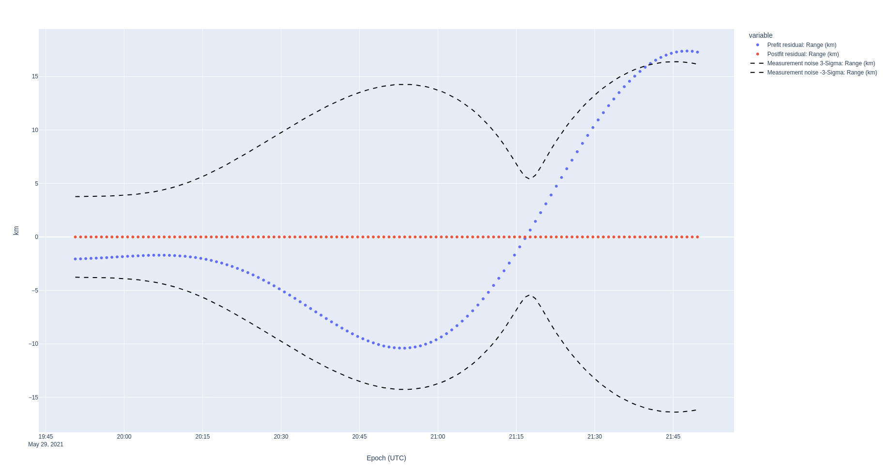

# Cislunar Autonomous Positioning System (CAPS) - Spacecraft Position & Navigation

The Cislunar Autonomous Positioning System (CAPS), originally called LiAISON, is a Position and Navigation algorithm (the _PN_ of _PNT_) which allows for two vehicles to perform relative orbit determination. Learn more about the implementation on [Advanced Space's website](https://advancedspace.com/caps/).

The only requirement is that the relative motion of both vehicles creates enough parallax in the measurement for one vehicle to observe another.
This is guaranteed when both vehicles fly in asymmetrical but well-characterized gravity fields, e.g. one vehicle in a lunar Halo orbit, and the other in a low lunar orbit.

Nyx was originally used to prove to NASA during an SBIR Phase 1 that the CAPS concept works, and was subsequently used early into the follow-on SBIR Phase 2.
JPL MONTE then added the ability to estimate the state of one vehicle with another ("flying ground station").

Although in theory, CAPS estimates the position of both vehicles at once, in practice that probably is not useful because the uncertainty on one of the vehicles is quite low initially.

## Interlink Spacecraft OD

Nyx allows building Range, Doppler, Azimuth, Elevation measurements, with appropriate stochastic noises, in between two spacecraft. These data can be used to solve for the position and navigation of one spacecraft versus another.

This example demonstrates solving the OD problem from a vehicle in a Near Rectangular Halo Orbit to a Low Lunar Orbit vehicle.
The noise models are initialized using the Signal to Noise ratio, the Carrier Power, and the communication frequency for the Range and Doppler between both vehicles.


[](https://asciinema.org/a/738451)

## Set up

The initial state used to generate the tracking data is dispersed within the provided covariance, with a given seed to ensure reproducibility.
The stochastic noises are defined by the Allan Deviation of the onboard clock, the signal to power ratio, the carrier power, and the frequency of the carrier.
This functionality is a novel approach to defining expected noises over a ranging link, and is not available in tools such as Ansys ODTK.

The initial state deviation is roughly 2.4 km. Without estimation, after two hours, thie 2.4 km error inflates to 17.5 km.

Below are the residuals on Range and Doppler when using the 2 hour tracking arc in residual versus reference mode. This is trivially supported by calling `arc.resid_vs_ref_check()`, and then the standard process_arc function, with the same initial state.




## Interlink OD results

After the orbit determination run, the comparison to truth is 209 meters after a short two hour arc.

Although this shows good performance, we note that the error on RIC Z in the Moon frame is reasonably high compared to the other axes. (Note that the RIC plot is jagged because it is averaged five samples at a time to smooth out potential interpolation errors.)


Filter gains


RIC errors with truth


```log
== Prediction @ 2021-05-29T19:51:16.000852000 TAI -- within 3 sigma: true ===
state total mass = 0.000 kg @  [Moon IAU_MOON] 2021-05-29T19:51:16.000852000 TAI	position = [1848.163017, -0.622143, 2.091090] km	velocity = [-0.001257, -0.000777, 1.629321] km/s  Coast
sigmas [2.500000 km, 2.500000 km, 2.500000 km, 0.000002 km/s, 0.000002 km/s, 0.000002 km/s, 0.000000 , 0.000000 , 0.000000 ]

RIC errors = [Moon orientation 145784200] 2021-05-29T19:51:16.000852000 TAI	position = [0.950332, -2.090312, 0.620827] km	velocity = [-0.001255, -0.000082, 0.000777] km/s
 INFO  nyx_space::od::process                       > Navigation propagating for a total of 1 h 59 min with step size 1 min
 INFO  nyx_space::od::process                       > Processing 120 measurements from {"NRHO Tx SC"}
 INFO  nyx_space::od::process                       >  10% done - 13 measurements accepted, 0 rejected
 INFO  nyx_space::od::process                       >  20% done - 25 measurements accepted, 0 rejected
 INFO  nyx_space::od::process                       >  30% done - 37 measurements accepted, 0 rejected
 INFO  nyx_space::od::process                       >  40% done - 49 measurements accepted, 0 rejected
 INFO  nyx_space::od::process                       >  50% done - 61 measurements accepted, 0 rejected
 INFO  nyx_space::od::process                       >  60% done - 73 measurements accepted, 0 rejected
 INFO  nyx_space::od::process                       >  70% done - 85 measurements accepted, 0 rejected
 INFO  nyx_space::od::process                       >  80% done - 97 measurements accepted, 0 rejected
 INFO  nyx_space::od::process                       >  90% done - 101 measurements accepted, 8 rejected
 INFO  nyx_space::od::process                       > 100% done - 101 measurements accepted, 19 rejected (done in 125 ms 522 μs 443 ns)
Filter OD solution from {("NRHO Tx SC", Range), ("NRHO Tx SC", Doppler)}, spanning 2021-05-29T19:51:16.000852000 TAI-2021-05-29T21:50:16.000852000 TAI, with 238 estimates, including 101 accepted residuals

 INFO  nyx_space::od::process::solution::export     > Exporting orbit determination result to parquet file...
 INFO  nyx_space::od::process::solution::export     > Serialized 238 estimates and residuals
 INFO  nyx_space::od::process::solution::export     > Orbit determination results written to /home/chris/Workspace/nyx-space/nyx/data/04_output/05_caps_interlink_od_sol.pq in 167 ms 196 μs 470 ns
 INFO  nyx_space::md::trajectory::traj              > Exporting trajectory to parquet file...
 INFO  nyx_space::md::trajectory::traj              > Serialized 120 states differences
 INFO  nyx_space::md::trajectory::traj              > Trajectory written to /home/chris/Workspace/nyx-space/nyx/data/04_output/05_caps_interlink_llo_est_error.pq in 47 ms 700 μs 414 ns
ESTIMATE
=== Prediction @ 2021-05-29T21:50:16.000852000 TAI -- within 3 sigma: true ===
state total mass = 0.000 kg @  [Moon IAU_MOON] 2021-05-29T21:50:16.000852000 TAI	sma = 1847.405262 km	ecc = 0.000096	inc = 90.002692 deg	raan = 0.004532 deg	aop = 358.435257 deg	ta = 2.313041 deg  Coast
sigmas [sma (km): 0.006670, ecc: 2.626657e-6, inc (deg): 0.002158, raan (deg): 0.030298, aop (deg): 0.136684, ta (deg): 0.132500]


TRUTH
total mass = 0.000 kg @  [Moon IAU_MOON] 2021-05-29T21:50:16.000852000 TAI	sma = 1847.400231 km	ecc = 0.000100	inc = 90.001876 deg	raan = 359.998154 deg	aop = 359.726798 deg	ta = 1.022805 deg  Coast
ERROR [Moon orientation 843333257] 2021-05-29T21:50:16.000852000 TAI	position = [-0.011598, -0.042047, 0.205277] km	velocity = [-0.000040, -0.000008, -0.000026] km/s
```
