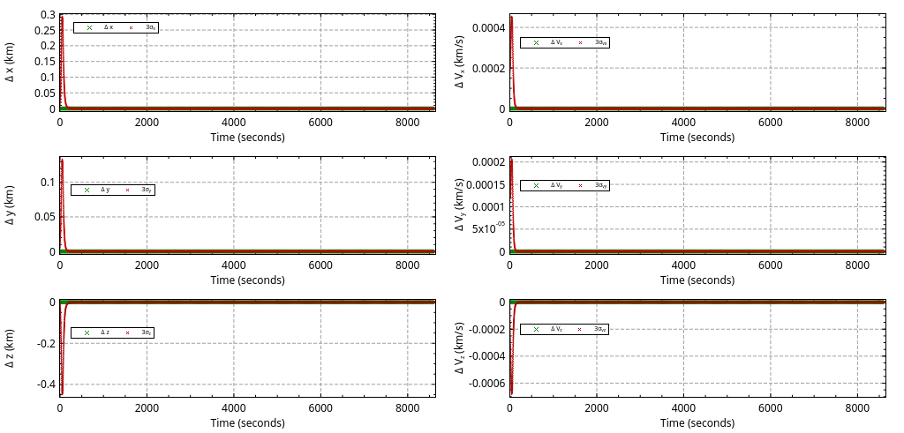

# Simple orbit determination
**Purpose:** prove that the orbital determination works as its own script.

In this example, we generate a truth orbit, and estimate its position using the three ground stations of NASA's Deep Space Network.

## Dynamics
- Two body propagation only, in the Earth Centered Inertial frame
- Ground stations are converted from the geodetic position to the Earth Centered Earth Fixed (ECEF) frame assuming only the Earth rotation rate (i.e. low fidelity ECEF frame)
- Initial estimate error is nil
- Initial covariance is small
- Range and range rate noise is strictly zero (i.e. the ground stations are making perfect measurements)

## Filter
- This is Classical Kalman filter until measurement number 15. At this point, we assume that we've got a good enough estimate, and as such switch to an Extended Kalman filter.

## Plot

## Explanation
The error estimation (in green) is plotted with the 3σ covariance for each component (in red). The covariance does not collapse immediately because we've set it to a non zero initial value, and it takes a certain number of measurements to nearly collapse.
