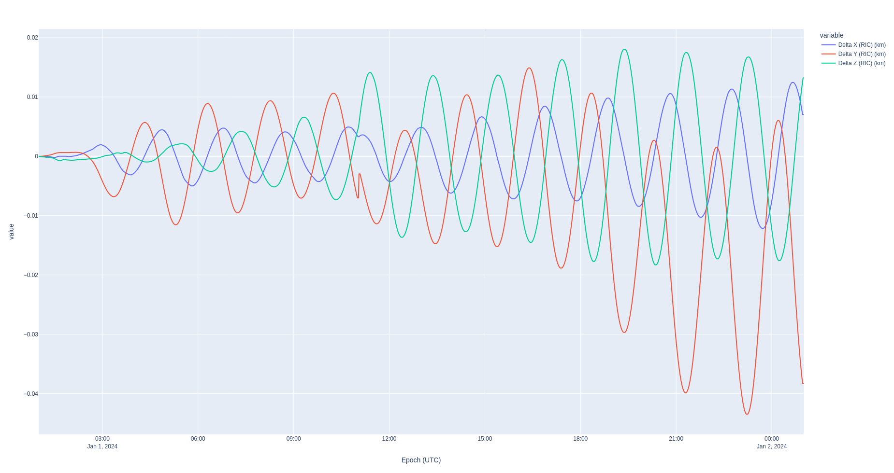
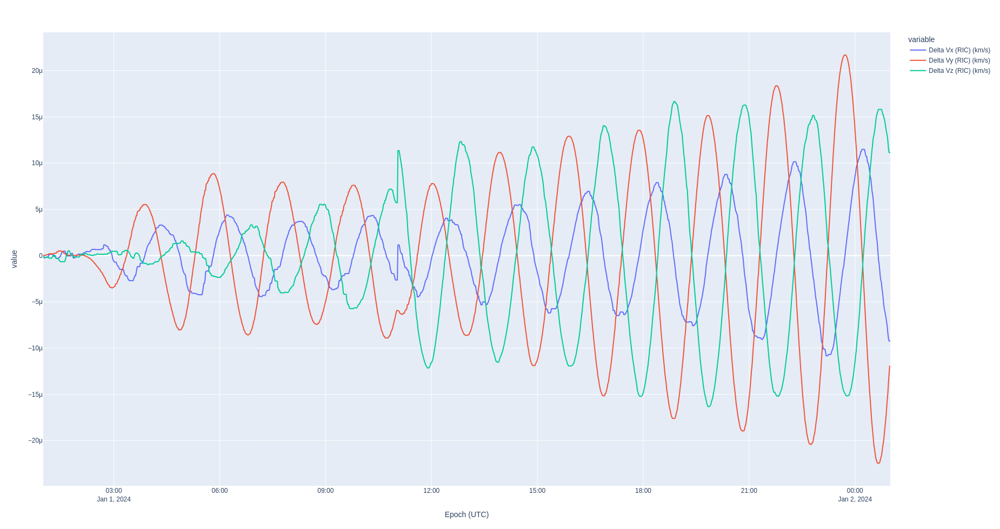
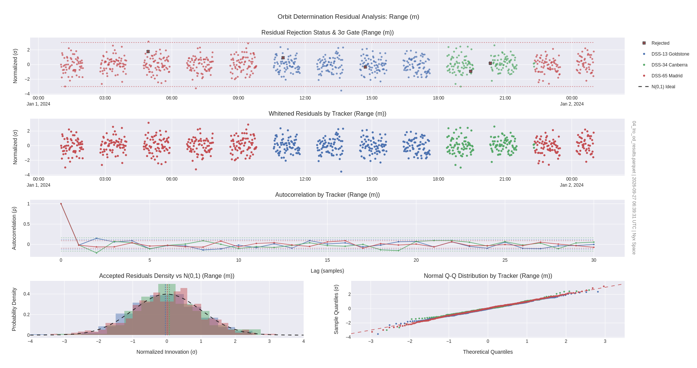
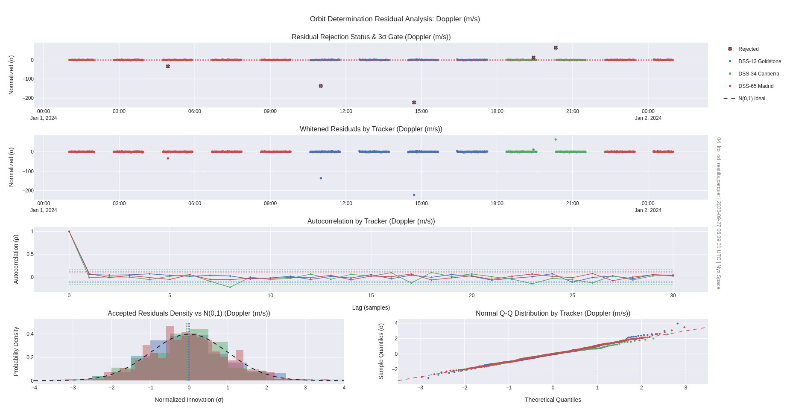
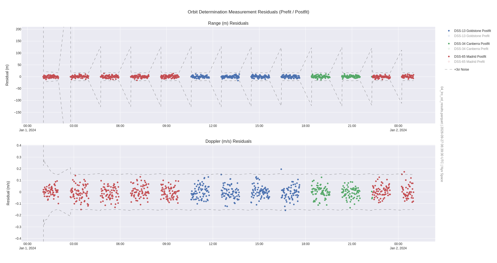
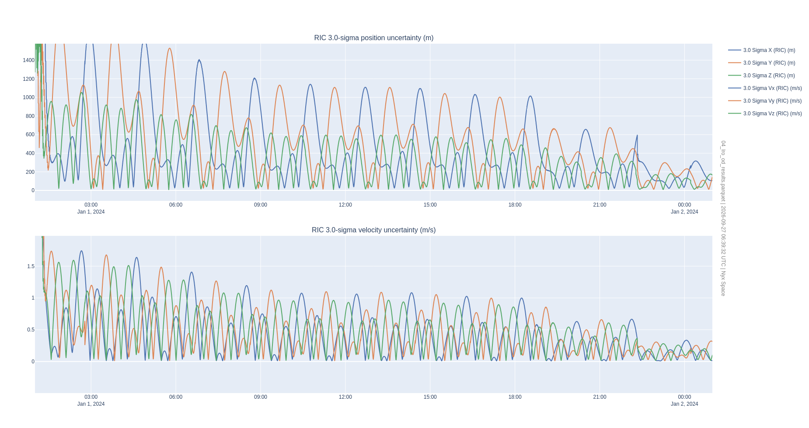
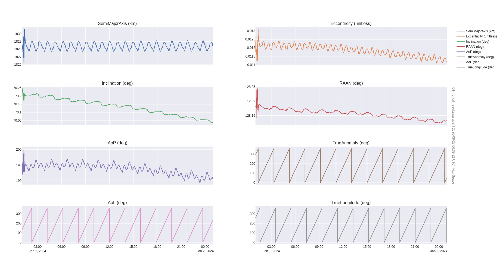
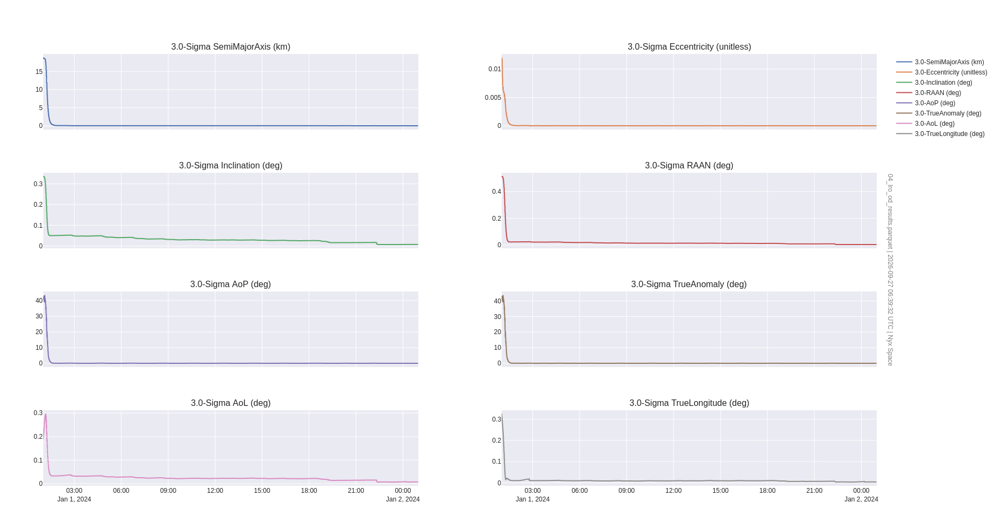

# Orbit Determination of the Lunar Reconnaissance Orbiter

**Spacecraft operations require high fidelity modeling of the orbital dynamics and high fidelity orbit determination. This example demonstrates that the LRO team could effectively use Nyx for orbit determination.**

In this example, you'll learn how to use an "as-flown" (_definitive_) SPICE BSP ephemeris file to simulate orbit determination measurements from ground stations. Then, you'll learn how to set up an orbit determination process in Nyx with high fidelity Moon dynamics and estimate the state of LRO. Finally, you'll learn how to compare two ephemerides in the Radial, In-track, Cross-track (RIC) frame.

[](https://asciinema.org/a/738443)

**Jump to the [results](#results)**

To run this example, just execute:
```sh
RUST_LOG=info cargo run --example 04_lro_od --release
```

Building in `release` mode will make the computation significantly faster. Specifying `RUST_LOG=info` will allow you to see all of the information messages happening in ANISE and Nyx throughout the execution of the program.

Throughout this analysis, we'll be focusing on an arbitrarily chosen period of one day started on 2024-01-01 at midnight UTC.

# Preliminary analysis: model matching

In the case of the Lunar Reconnaissance Orbiter (herein _LRO_), NASA publishes the definitive ephemeris on the website. Therefore, the first step in this analysis is to match the dynamical models between the LRO team and Nyx. This serves as a validation of the dynamical models in Nyx as well.

The original ephemeris file by NASA is in _big endian_ format, and my machine (like most computers) is little endian. I've used the `bingo` tool from https://naif.jpl.nasa.gov/naif/utilities_PC_Linux_64bit.html to convert the original file to little endian and upload it to the public data cloud hosted on <http://public-data.nyxspace.com>. Refer to https://naif.jpl.nasa.gov/pub/naif/pds/data/lro-l-spice-6-v1.0/lrosp_1000/data/spk/?C=M;O=D for original file. Also note that throughout this analysis, we're using the JPL Development Ephemerides version 421 instead of the latest and greated DE440 because LRO uses DE421 (although analysis shows no noticeable difference in switching out these ephems).

For this preliminary analysis, we'll configure the dynamical models taking inspiration from the 2015 paper by Slojkowski et al. [Orbit Determination For The Lunar Reconnaissance Orbiter Using
An Extended Kalman Filter](https://ntrs.nasa.gov/api/citations/20150019754/downloads/20150019754.pdf). In this paper, the LRO team compares the OD solution between GTDS and AGI/Ansys ODTK. We will be performing the same analysis but with Nyx!

Cislunar propagation involves several well-determined forces, which can be directly used in Nyx:

- Solar radiation pressure;
- Point mass gravity forces from the central object (Moon) and other celestial objects whose force is relevant, namely Earth, Sun, Jupiter, maybe Saturn;
- Moon gravity field because we're in a low lunar orbit, so it greatly affects the orbital dynamics

The purpose of this analysis is to ensure that we've configured these models correctly. This process is tedious because each dynamical model must be configured differently and the difference between the propagation and the truth ephemeris need to be assessed.

Nyx uses the Luna JGGRX model, the coefficients of which differ slightly from the STK/ODTK `B` version of the GRAIL gravity field (not sure why). While the point mass gravity computed by Nyx will always use the configured gravitational values, the gravity field will properly account for the GM value in the SHADR file, which matches closely with the default data in GMAT/STK.





## Dynamical models

- Solar radiation pressure: **Cr 0.96**
- Point mass gravity forces from the central object, **Moon: GM = 4902.74987 km^2/s^3** and other celestial objects whose force is relevant, namely Earth (**GM = 398600.436 km^3/s^**), Sun, and Jupiter;
- Moon gravity field GRAIL model JGGRX with the Moon Principal Axes frames (MOON PA) in 81x81 (degree x order)


```text
SIM v LRO - RIC Position (m):
  ┌         ┐
  │   5.894 │
  │ -39.679 │
  │  13.865 │
  └         ┘


SIM v LRO - RIC Velocity (m/s):
  ┌        ┐
  │ -0.010 │
  │ -0.011 │
  │  0.010 │
  └        ┘
```

# Orbit determination set up

## Ground network

For this example, we simulate measurements from three of the Deep Space Network ground stations: Canberra, Australia; Madrid, Spain; and Goldstone, CA, USA. Nyx allows configuration of ground stations using a YAML input file, cf. [`dsn-network`](./dsn-network.yaml). These are configured as unbiased white noise ground stations where the standard deviation of the white noise is taken directly from the JPL DESCANSO series. The stochastic modeling in Nyx supports first order Gauss Markov processes and biased white noise.

In this simulation, we are generating light-time corrected two-way range and Doppler measurements. Nyx also supports relativistic corrections with the Shapiro Delay computation, but it isn't enabled in this simulation.

## Tracking schedule

To prepare for a mission, flight dynamics engineers must simulate a tracking schedule and determine, through trial and error, how much tracking is required throughout the different orbital regimes of the mission. Unlike most orbit determination software, Nyx provides a "schedule generator" for simulation. Refer to [`tracking-cfg.yaml`](./tracking-cfg.yaml) for the tracking configuration. In short, this feature allows engineers to configure the following key inputs to a schedule:

- how to deal with overlapping measurements: greedy, eager, or overlap.
    - Greedy: when two stations overlap, the one which was previously tracking will continue until the vehicle is no longer in sight
    - Earger: when two stations overlap, the new tracker will start tracking instead of the previous one
    - Overlap: both stations may track and generate tracking data at the same time.
- how many minimum samples are needed for this pass to be included: this prevents very short passes;
- are the measurements taken exactly at a round number of seconds;
- what is the sampling rate of this ground station.

The tracking scheduler will start by finding the exact times when the vehicle comes in view, using the embedded event finder on an elevation event.

```log
 INFO  nyx_space::od::simulator::arc      > Tracking Arc Simulator on Trajectory of LRO in Moon J2000 (μ = 4902.800066163796 km^3/s^2, radius = 1737.4 km) from 2024-01-01T01:00:00 UTC to 2024-01-02T01:00:00 UTC (1 day, or 86400.000 s) [17281 states] with devices ["DSS-13 Goldstone", "DSS-34 Canberra", "DSS-65 Madrid"] over TimeSeries [2024-01-01T01:00:00 UTC : 2024-01-02T01:00:00 UTC : 1 min]
 INFO  nyx_space::od::simulator::arc      > Building schedule for DSS-13 Goldstone
 INFO  nyx_space::od::simulator::arc      > Built 1 tracking strands for DSS-13 Goldstone
 INFO  nyx_space::od::simulator::arc      > Building schedule for DSS-34 Canberra
 INFO  nyx_space::od::simulator::arc      > Built 1 tracking strands for DSS-34 Canberra
 INFO  nyx_space::od::simulator::arc      > Building schedule for DSS-65 Madrid
 INFO  nyx_space::od::simulator::arc      > Built 2 tracking strands for DSS-65 Madrid
 INFO  nyx_space::od::simulator::arc      > Greedy handoff for DSS-65 Madrid: DSS-13 Goldstone delayed to 2024-01-01T10:00:20 UTC
 INFO  nyx_space::od::simulator::arc      > Greedy handoff for DSS-13 Goldstone: DSS-34 Canberra delayed to 2024-01-01T18:09:50 UTC
 INFO  nyx_space::od::simulator::arc      > Eager handoff for DSS-34 Canberra: DSS-34 Canberra terminated at 2024-01-01T22:19:00 UTC
 INFO  nyx_space::od::simulator::arc      > Simulated 286 measurements for DSS-13 Goldstone for 1 tracking strands in 64 ms
 INFO  nyx_space::od::simulator::arc      > Simulated 147 measurements for DSS-34 Canberra for 1 tracking strands in 33 ms
 INFO  nyx_space::od::simulator::arc      > Simulated 460 measurements for DSS-65 Madrid for 2 tracking strands in 96 ms
 INFO  nyx_space::od::msr::trackingdata::io_parquet > Serialized Tracking arc with 893 measurements of type {Range, Doppler} over 23 h 58 min (from 2024-01-01T01:01:00 UTC to 2024-01-02T00:59:00 UTC) with trackers {"DSS-65 Madrid", "DSS-13 Goldstone", "DSS-34 Canberra"} to /home/chris/Workspace/nyx-space/nyx-premium/nyx-core/../data/04_output/04_lro_simulated_tracking.parquet
Tracking arc with 893 measurements of type {Range, Doppler} over 23 h 58 min (from 2024-01-01T01:01:00 UTC to 2024-01-02T00:59:00 UTC) with trackers {"DSS-65 Madrid", "DSS-13 Goldstone", "DSS-34 Canberra"}
```

## Tracking arc

In this simulation, we use the official ephemeris to generate simulated measurements. In other words, we don't simulate a new ephemeris. **This serves as a validation of the orbit estimation in low lunar orbits,** the most dynamical of the cislunar orbits.

## Filter set up

The OD filter uses the [dynamics determined above](#dynamical-models) after the [model matching](#preliminary-analysis-model-matching) analysis.

The default filter will reject measurements where the whitened residual is more than 3 sigma away from the mean. This is akin to the residual ratios.

Nyx can compute the Normalized Innovations Squared error (NIS) directly: this is an excellent metric to assess whether a filter is properly tuned.

```text
== FILTER STATE ==
total mass = 1918.000 kg @  [Moon J2000] 2024-01-01T01:00:00 UTC	sma = 1828.072432 km	ecc = 0.011916	inc = 70.220437 deg	raan = 128.179300 deg	aop = 195.371878 deg	ta = 289.201603 deg  Coast
=== Prediction @ 2024-01-01T01:00:00 UTC -- within 3 sigma: true ===
state total mass = 1918.000 kg @  [Moon J2000] 2024-01-01T01:00:00 UTC	position = [239.836127, -1125.735007, 1410.697143] km	velocity = [1.082605, -0.857662, -0.892255] km/s  Coast
sigmas [375.000000 m, 375.000000 m, 375.000000 m, 0.037500 m/s, 0.037500 m/s, 0.037500 m/s, 0.000000e0 , 0.000000e0 , 0.000000e0 ]

Process noise: diag(1.4e-10, 1.4e-10, 1.4e-10) mm/s^2
 INFO  nyx_space::od::process                       > Navigation propagating for a total of 23 h 59 min with step size 1 min
 INFO  nyx_space::od::process                       > Processing 893 measurement epochs from {"DSS-65 Madrid", "DSS-13 Goldstone", "DSS-34 Canberra"}
 INFO  nyx_space::od::process                       >  10% done - 2024-01-01T03:17:00 UTC - 91 measurements accepted, 0 rejected
 INFO  nyx_space::od::process                       >  20% done - 2024-01-01T05:32:00 UTC - 179 measurements accepted, 1 rejected
 INFO  nyx_space::od::process                       >  30% done - 2024-01-01T07:47:00 UTC - 268 measurements accepted, 1 rejected
 INFO  nyx_space::od::process                       >  40% done - 2024-01-01T10:49:20 UTC - 358 measurements accepted, 1 rejected
 INFO  nyx_space::od::process                       >  50% done - 2024-01-01T13:04:20 UTC - 446 measurements accepted, 2 rejected
 INFO  nyx_space::od::process                       >  60% done - 2024-01-01T15:18:20 UTC - 534 measurements accepted, 3 rejected
 INFO  nyx_space::od::process                       >  70% done - 2024-01-01T17:33:20 UTC - 624 measurements accepted, 3 rejected
 INFO  nyx_space::od::process                       >  80% done - 2024-01-01T20:32:50 UTC - 711 measurements accepted, 5 rejected
 INFO  nyx_space::od::process                       >  90% done - 2024-01-01T22:47:00 UTC - 799 measurements accepted, 6 rejected
 INFO  nyx_space::od::process                       > 100% done - 2024-01-02T00:59:00 UTC - 887 measurements accepted, 6 rejected (done in 10 s 518 ms 814 μs 730 ns)
=== Estimate @ 2024-01-02T00:59:00 UTC -- within 3 sigma: true ===
state total mass = 1918.000 kg @  [Moon J2000] 2024-01-02T00:59:00 UTC	position = [1022.725419, -464.930538, -1424.391242] km	velocity = [-0.600204, 1.272278, -0.862984] km/s  Coast
sigmas [0.126777 m, 6.189739 m, 0.314078 m, 3.256489e-7 m/s, 3.057796e-6 m/s, 4.944642e-6 m/s, 0.000000e0 , 0.000000e0 , 0.000000e0 ]

== RIC at end ==
RIC Position (m):
  ┌         ┐
  │  -1.773 │
  │ -51.469 │
  │ -35.288 │
  └         ┘


RIC Velocity (m/s):
  ┌        ┐
  │ -0.002 │
  │  0.002 │
  │ -0.051 │
  └        ┘


Num residuals rejected: #5
Percentage within +/-3: 0.9943946188340808
Ratios normal? true
 INFO  nyx_space::od::process::solution::stats      > NIS passed
 INFO  nyx_space::od::process::solution::export     > Exporting orbit determination result to parquet file...
 INFO  nyx_space::od::process::solution::export     > Serialized 3800 estimates and residuals
 INFO  nyx_space::od::process::solution::export     > Orbit determination results written to /home/chris/Workspace/nyx-space/nyx-premium/nyx-core/../data/04_output/04_lro_od_results.parquet in 58 ms 487 μs 759 ns
 WARN  anise::ephemerides::ephemeris::spk           > ephemeris contains covariance, which is NOT copied to the SPICE BSP file
 INFO  anise::almanac                               > Loading /home/chris/Workspace/nyx-space/nyx-premium/nyx-core/../data/04_output/04_lro_rebuilt.bsp as DAF/SPK
=== SPK #0: `/home/chris/Workspace/nyx-space/nyx-premium/nyx-core/../data/04_output/04_lro_rebuilt.bsp` ===
┌──────────────────────────────────────────┬────────────────┬────────────┬───────────────────────────────────┬───────────────────────────────────┬─────────────┬──────────────────────┐
│ Name                                     │ Target         │ Center     │ Start epoch                       │ End epoch                         │ Duration    │ Interpolation kind   │
├──────────────────────────────────────────┼────────────────┼────────────┼───────────────────────────────────┼───────────────────────────────────┼─────────────┼──────────────────────┤
│ LRO rebuilt (converted by Nyx Space ANIS │ body -85 J2000 │ Moon J2000 │ 2024-01-01T01:02:09.183899870 TDB │ 2024-01-02T01:00:09.183928806 TDB │ 23 h 58 min │ Hermite Unequal Step │
└──────────────────────────────────────────┴────────────────┴────────────┴───────────────────────────────────┴───────────────────────────────────┴─────────────┴──────────────────────┘
 INFO  nyx_space::md::trajectory::traj              > Exporting trajectory to parquet file...
 INFO  nyx_space::md::trajectory::traj              > Serialized 1439 states differences
 INFO  nyx_space::md::trajectory::traj              > Trajectory written to /home/chris/Workspace/nyx-space/nyx-premium/nyx-core/../data/04_output/04_lro_od_truth_error.parquet in 17 ms 659 μs 314 ns
```

# Results

Nyx provides a `nyx_plot_od` helper script in the Python package which will build all of the essential plots for a flight dynamics engineer: `$ nyx_plot_od -p ../data/04_output/04_lro_od_results.parquet`






Note how the residuals are properly (very near) zero mean and follow a Normal distribution.





## Orbital elements





# Conclusion

This validates using Nyx for precise lunar orbit determination using publicly available data. Nyx provides several important metrics most orbit determination software skips, like K-S normality check, NIS, and NEES when a truth trajectory is known.
